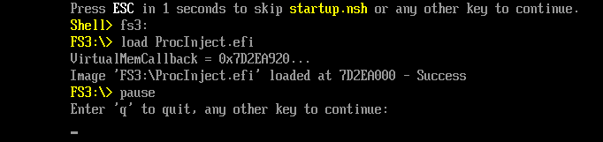
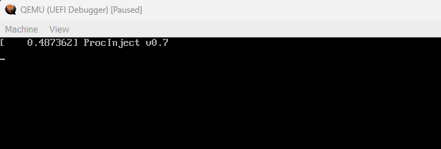
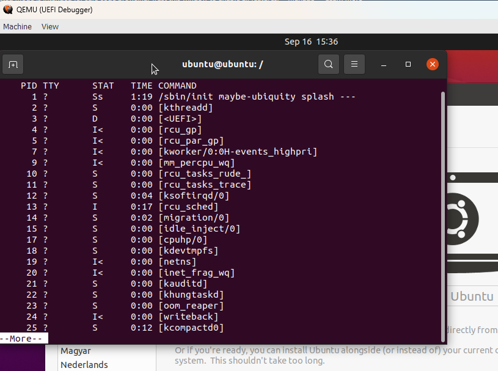

## Synopsis

This project is based on a fork of Alex Ionescu's VisualUefi repo at  https://github.com/ionescu007/VisualUefi

* This project adds another UEFI driver (ProcInject) in the samples project to demonstrate a proof-of-concept UEFI Linux Kernel thread injector using a SetVirtualAddressMap (SVAM) callback routine. This POC is specific to the Intel x86_64 architecture and Linux 5.13 kernel as found in the Ubuntu 20.04.4 LiveCD .iso.

* SVAM callbacks are invoked by the Linux kernel routine ```start_kernel``` during boot when the kernel transitions to virtual memory addressing. By examining return addresses on the stack, the callback routine is able to determine the location of calling code including the address of the ```printk``` kernel function. At this point kernel address space randomization has already taken place. The ```System.map``` file for this Linux kernel (5.13 in this particular example) gives addresses for all the visible kernel functions (including ```printk```) so that once printk is determined, other kernel routines (```__kmalloc```, ```kthread_create_on_node```, etc.) become known via the ```System.map``` file as fixed offsets relative to ```printk```.

* This demo uses a working and FAST copy of QEMU64 2.10 for Windows. Windows command .bat scripts are used to invoke QEMU with or without gdb debugger support/control.

## Theory of Operation

SetVirtualAddressMap callbacks are executed during OS boot, after ExitBootServices has been called and UEFI DXE memory freed. The intended purpose of SetVirtualAddressMap is to allow UEFI runtime services to adjust their addresses from physical to virtual since the CPU is transitioning to virtual address mode.

In the context of Ubuntu Linux boot, the routine that triggers the UEFI SetVirtualAddressMap callbacks is efi_enter_virtual_mode, which is called about 3/4 of the way through ```start_kernel``` in ```init/main.c```.

As ProcInject SVAM callack executes, it examines the call stack in memory searching for a return address that points to code similar to the known ```efi_enter_virtual_mode``` code:

```c
status = efi_call_phys(__va(runtime->set_virtual_address_map),
			       ia64_boot_param->efi_memmap_size,
			       efi_desc_size,
			       ia64_boot_param->efi_memdesc_version,
			       ia64_boot_param->efi_memmap);
	if (status != EFI_SUCCESS) { <--- Return address points here
		printk(KERN_WARNING "warning: unable to switch EFI into "
		       "virtual mode (status=%lu)\n", status);
		return;
	}
```

The corresponding X86_64 assembler for the return address code resembles the following; exact addresses may vary due to Kernal Address Space Layout Randomization (KASLR).

```asm
    0xffffffffXXXeb9b1:  mov    ecx,ebp
    0xffffffffXXXeb9b3:  mov    edx,DWORD PTR [rip+0xfffffffffff7e2e7]        # 0xffffffffXXX69ca0
    0xffffffffXXXeb9b9:  imul   rbx,rsi
    0xffffffffXXXeb9bd:  mov    rdi,rbx
    0xffffffffXXXeb9c0:  call   0xffffffffXXXec1ba <---- call SVAM>

	0xffffffffXXXeb9c5:  mov    rsi, rax <--- Original return addr>
	0xffffffffXXXeb9c8 : test   rax, rax
	0xffffffffXXXeb9cb : je     0xffffffffXXXeb9db
	0xffffffffXXXeb9cd : mov    rdi, 0xffffffffXXXbcd40 <- Verify "\0013efi: Unable to switch EFI into virtual mode(status = % lx)!\n"
	0xffffffffXXXeb9d4 : call   0xffffffffXXXa1d56 <- printk addresss
	0xffffffffXXXeb9d9 : jmp    0xffffffffXXXeba08
	0xffffffffXXXeb9db : call   0xffffffffXXX2f360
```

Once the ```printk``` address has been determined, other addresses needed such as ```__kmalloc``` and ```kthread_create_on_node``` are deduced as offsets found in the ```System.map``` file.

## First patch (simple printk call)

The SVAM callback cannot call ```printk``` directly since it executes in a firmware context, not a kernel context. However, it is possible to modify the ```__init``` memory occupied by ```start_kernel``` and ```efi_enter_virtual_mode```. Once the ```efi_enter_virtual_mode``` return address is discovered, it becomes possible to patch the code to call ```printk``` passing a string with the ProcInject driver version number. To do this, the ```efi_enter_virtual_mode``` return address is moved back a few bytes and code inserted to make the ```printk``` call. There is no other change to functionality since the code being overwritten has already executed and will never be called again on this boot.

```asm
	// BannerMsg:
	   db   "\001\063ProcInject v0.7"
	// New_Return_Addr:
	   push rax    ; save the return status from SVAM
	   mov  rdi, BannerMsg
	   call printk ; announce ourselves
	   pop  rax    ; restore return status from SVAM
    // Orig_Return_Addr:
	   mov  rsi, rax
```

## Patch2 (Kernel Thread Create)

The second patch is considerably more complex than the first. Code is added to create a new kernel thread and have it invoked via ```kthreadd```, the kernel thread daemon. Patch2 executes near the very end of the ```start_kernel``` code, just before the system goes multi-threaded. Here is the remaining ```start_kernel``` code following the call to ```efi_enter_virtual_mode```:

```c
#ifdef CONFIG_X86
	if (efi_enabled(EFI_RUNTIME_SERVICES))
		efi_enter_virtual_mode();
#endif
	thread_stack_cache_init();
	cred_init();
	fork_init();
	proc_caches_init();
	uts_ns_init();
	key_init();
	security_init();
	dbg_late_init();
	vfs_caches_init();
	pagecache_init();
	signals_init();
	seq_file_init();
	proc_root_init();
	nsfs_init();
	cpuset_init();
	cgroup_init();
	taskstats_init_early();
	delayacct_init();

	poking_init();
	check_bugs();

	acpi_subsystem_init();
	arch_post_acpi_subsys_init();
	kcsan_init();

	/* Do the rest non-__init'ed, we're now alive */
	arch_call_rest_init(); <-> Patch2 will run in here

	prevent_tail_call_optimization();
```

As seen in the corresponding X86_64 assembler, it is straightforward for the SVAM callback to scan through the call instructions until an ```mfence``` instruction is found to determine the ```arch_call_rest_init``` address.

```asm
   XXXc17d3:  call   XXXc118d <- thread_stack_cache_init>
   XXXc17d8:  call   XXXee55f
   XXXc17dd:  call   XXXecd83
   XXXc17e2:  call   XXXecf83
   XXXc17e7:  call   XXXf4242
   XXXc17ec:  call   XXX05743
   XXXc17f1:  call   XXX06451
   XXXc17f6:  call   XXXf4a74
   XXXc17fb:  call   XXX01199
   XXXc1800:  call   XXXf9036
   XXXc1805:  call   XXXeda02
   XXXc180a:  call   XXX01696
   XXXc180f:  call   XXX02cb0
   XXXc1814:  call   XXX01720
   XXXc1819:  call   XXXf406a
   XXXc181e:  call   XXXf3b65
   XXXc1823:  call   XXXf4fa9
   XXXc1828:  call   XXXa51a0
   XXXc182d:  call   XXXe62ec
   XXXc1832:  call   XXXd3635
   XXXc1837:  call   XXX13664
   XXXc183c:  call   XXXd1dd8
   XXXc1841:  call   XXXc1167 <- arch_call_rest_init>
   XXXc1846:  mfence          <- prevent_tail_call_optimization>

```

On Intel X86_64, ```arch_call_rest_init``` simply calls ```rest_init```:

```c
void __init __weak arch_call_rest_init(void)
{
	rest_init();
}
```
which looks like this:
```c
noinline void __ref rest_init(void)
{
	struct task_struct *tsk;
	int pid;

	rcu_scheduler_starting();
	/*
	 * We need to spawn init first so that it obtains pid 1, however
	 * the init task will end up wanting to create kthreads, which, if
	 * we schedule it before we create kthreadd, will OOPS.
	 */
	pid = kernel_thread(kernel_init, NULL, CLONE_FS);
	/*
	 * Pin init on the boot CPU. Task migration is not properly working
	 * until sched_init_smp() has been run. It will set the allowed
	 * CPUs for init to the non isolated CPUs.
	 */
	rcu_read_lock();
	tsk = find_task_by_pid_ns(pid, &init_pid_ns);
	set_cpus_allowed_ptr(tsk, cpumask_of(smp_processor_id()));
	rcu_read_unlock();

	numa_default_policy();
	pid = kernel_thread(kthreadd, NULL, CLONE_FS | CLONE_FILES);
	rcu_read_lock();
	kthreadd_task = find_task_by_pid_ns(pid, &init_pid_ns);
	rcu_read_unlock();

	/*
	 * Enable might_sleep() and smp_processor_id() checks.
	 * They cannot be enabled earlier because with CONFIG_PREEMPTION=y
	 * kernel_thread() would trigger might_sleep() splats. With
	 * CONFIG_PREEMPT_VOLUNTARY=y the init task might have scheduled
	 * already, but it's stuck on the kthreadd_done completion.
	 */
	system_state = SYSTEM_SCHEDULING;

	complete(&kthreadd_done); <-- Overwrite with a jump to Patch2

	/*
	 * The boot idle thread must execute schedule()
	 * at least once to get things moving:
	 */
	schedule_preempt_disabled(); <-- Kthreads run, __init cleanup starts>
	/* Call into cpu_idle with preempt disabled */
	cpu_startup_entry(CPUHP_ONLINE);
}
```
To implement the UEFI kthread creation, the call to ```complete(&kthreadd_done)``` in ```rest_init``` is overwritten with a jump to the Patch2 code. Patch2 code is written to ```__init``` code space prior to the call to ```efi_enter_virtual_mode```. This is code that has already executed prior to the SVAM callback and will never be run again on this boot. It is also reclaimed by ```free_initmem``` so we can't use this space for our kernel thread function. It must be ```__kmalloc'ed``` instead. 

Recall that Linux kernel SysV argument passing uses ```rdi, rsi, rcx, rdx``` for the first 4 arguments.

Initial code in rest_init() looks like this:
```asm
mov    rdi,0xffffffffXXX7e8e0           ; &kthreadd_done
mov    DWORD PTR[rip + 0x1563a20], 0x1  ; system_state = SCHEDULING
call   0xffffffffXXX00b10               ; complete(&kthreadd_done)
call   0xffffffffXXX013c0               ; schedule_preempt_disabled
                                        ; goes multi-thread here
mov    edi, 0xe1                        ; CPUHP_ONLINE
call   0xffffffffXXXe87e0               # cpu_startup_entry
pop    rbp
ret
```

Patched code looks like this:
```asm
mov    rdi,0xffffffffXXX7e8e0           # &kthreadd_done
mov    DWORD PTR[rip + 0x1563a20], 0x1  # system_state = SCHEDULING
jmp    patch_2                          # patch_2 code below
//     return_from_patch2:
call   0xffffffffXXX013c0               # schedule_preempt_disabled
                                        # goes multi-thread here 
mov    edi, 0xe1                        # CPUHP_ONLINE
call   0xffffffffXXXe87e0               # cpu_startup_entry
pop    rbp
ret
```

## POC UEFI Kernel Thread

For this proof-of-concept, the injected kernel thread code is very simple. Basically, it sleeps forever:
```c
UEFI_Kthread() {
	while (1) {
		msleep(86400*1000);
	}
}
```

The corresponding x86_64 kthread code template:
```asm
// proc_template (data+code):
// thread_name:
"<UEFI>"
// kthread code:
push    rdi
// loop1:
mov     rdi, 86400 * 1000 ; 1 day
mov     rax, msleep
call    rax               ; msleep(86400*1000)
jmp     loop1
pop     rdi
xor     rax, rax          ; clear return status
ret
```
The patch_2 code:
```asm
//    patch_2:
push    rdi                               # save &kthreadd_done
// create new UEFI kernel thread
push    rsi
push    rcx
push    rdx
mov     rdi, sizeof(proc_template)
mov     rsi, GPF_KERNEL | GPF_ZERO
call    __kmalloc ; allocate permanent space for the kthread
mov     rdi, rax  ; set destination address
lea     rsi, [proc_template] ; src: point to proc_template
cld
mov     ecx, sizeof(proc_template)
rep     movsb   ; copy the template to permanent memory
mov     rdi, rax ; point to permanent memory
add     rdi, sizeof(thread_name) ; point to start of code
xor     rsi, rsi                 ; rsi = 0
xor     rdx, rdx                 ; rdx = 0
not     rdx                      ; rdx = -1
mov     rcx, rax                 ; "<UEFI>"
call    kthread_create_on_node   ; (kthread_code, 0, -1, "<UEFI>")
pop     rdx
pop     rcx
pop     rsi
pop     rdi                            # restore &kthreadd_done
call 0xffffffffXXX00b10                # complete(&kthreadd_done)
jmp  0xffffffffXXXf7e29                # resume rest_init() code
	//
```

## Future Directions

This POC is currently working with only a single version of the Linux kernel (v5.13). One area of potential investigation could cover the possibility of extending it to recognize multiple kernel versions.

The current kernel thread being injected is exceedingly simple. A more complex thread would need to be developed and tested to demonstrate a proto-agent for endpoint management, for example.

## Installation

First install NASM (https://www.nasm.us/) and check that environment variable NASM_PREFIX is correctly set to NASM installation path. No other 3rd party tools are needed.

Than you should be able to open the EDK-II.SLN file and build without any issues in either Visual Studio 2015, 2017, or 2022. WDK is not needed. 

Once the EDK-II libraries are built, you should be able to open the SAMPLES.SLN file and build the samples, which will create ProjInject.efi, UefiApplication.efi, UefiDriver.efi, Cryptest.efi, and FtdiUsbSerialDxe.efi

To run the demo, a copy of the Ubuntu 20.04.4 LiveCD .iso file is required. The particular file needed is ubuntu-20.04.4-desktop-amd64.iso. Modify the path in debugger/run.bat to point to it. Once the SAMPLES.SLN project is built, execute the test by opening a command window in the debugger folder and invoke the run.bat script. The ProcInject driver should automatically load. On loading, the driver displays the physical address of the SVAM callback routine for use when running under the gdb debugger. Hit any key but 'q' to continue.



Ubuntu Linux boot follows. You should briefly see a printk message on the screen announcing the execution of the ProcInject callback ("ProcInject v.xx").



* When the "Install or Try Ubuntu Linux" screen is presented,
Enter Ctl-Alt-T to get to a text terminal and run "ps agx | more".
You might have to enter Ctl-Alt-G first to release the QEMU grab on the mouse/cursor. You should see the <UEFI> kernel thread listed with PID 3.



## Documentation

Please refer to EDK-II/TianoCore for all documentation/help regarding EDK-II.

## Contributors

Please use the GitHub issue tracker to submit any bugs/requests/etc.

## License

* For the ProcInject driver contained in the "samples" folder, the following license applies:

		Copyright (c) 2025, Microsoft Corporation. All rights reserved.

* For the "samples" (except the ProjInject driver) and "edk-ii" directory, the following license applies:

		Copyright (c) 2015-2017, Alex Ionescu. All rights reserved.
		This program and the accompanying materials are licensed and made available under
		the terms and conditions of the BSD License which accompanies this distribution. 
		The full text of the license may be found at
		http://opensource.org/licenses/bsd-license.php

* For the "debugger" directory, the following license applies:

		The following points clarify the QEMU license:

		1) QEMU as a whole is released under the GNU General Public License,
		version 2.

		2) Parts of QEMU have specific licenses which are compatible with the
		GNU General Public License, version 2. Hence each source file contains
		its own licensing information.  Source files with no licensing information
		are released under the GNU General Public License, version 2 or (at your
		option) any later version.

		As of July 2013, contributions under version 2 of the GNU General Public
		License (and no later version) are only accepted for the following files
		or directories: bsd-user/, linux-user/, hw/misc/vfio.c, hw/xen/xen_pt*.

		3) The Tiny Code Generator (TCG) is released under the BSD license
		   (see license headers in files).

		4) QEMU is a trademark of Fabrice Bellard.

		Fabrice Bellard and the QEMU team

* The "edk2" submodule has its own licensing information, please read it.
